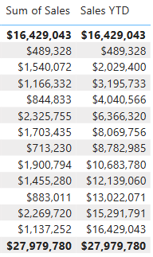

---
lab:
    title: 'Używanie funkcji inteligencji czasu w DAX w Power BI'
---

# Używanie funkcji inteligencji czasu (DAX) w Power BI

## Opis laboratorium

W tym laboratorium utworzysz miary z użyciem wyrażeń DAX, które wykorzystują funkcje inteligencji czasu.

W tym laboratorium nauczysz się:

- korzystać z funkcji inteligencji czasu, aby modyfikować kontekst filtrowania dotyczący dat.

**To laboratorium zajmie około 15 minut.**

---

## Rozpoczęcie

Aby wykonać ćwiczenie, pobierz plik:

`06-time-intelligence.zip`

Rozpakuj plik do folderu:

**C:\Users\Student\Downloads\06-time-intelligence**

Otwórz plik **06-Starter-Sales Analysis.pbix**.

> **Uwaga:** podczas ładowania pliku może pojawić się okno logowania — wybierz **Cancel**. Zamknij dodatkowe okna informacyjne. Jeśli pojawi się okno aplikacji zmian, wybierz **Apply Later**.

---

## Tworzenie miary YTD

W tym zadaniu utworzysz miarę sprzedaży rok-do-daty (YTD) za pomocą funkcji inteligencji czasu.

1. W Power BI Desktop, w **Report view**, na **Page 2**, zauważ wizual macierzowy pokazujący różne miary w podziale na rok i miesiąc.

2. Dodaj miarę do tabeli `Sales`, opartą na następującym wyrażeniu i sformatuj ją do 0 miejsc po przecinku:

    ```dax
    Sales YTD =
    TOTALYTD(
        SUM(Sales[Sales]),
        'Date'[Date],
        "6-30"
    )
    ```

    > Funkcja `TOTALYTD` oblicza wyrażenie (sumę kolumny Sales) na podstawie kolumny dat. Kolumna ta musi pochodzić z tabeli oznaczonej jako tabela dat.

    > Trzeci parametr to ostatnia data w roku; brak tej wartości oznacza 31 grudnia. W Adventure Works ostatnim miesiącem roku fiskalnego jest czerwiec, więc użyto „6-30”.

3. Dodaj pole `Sales` oraz miarę `Sales YTD` do macierzy.

4. Zwróć uwagę na narastanie wartości sprzedaży w obrębie roku.



> Funkcja `TOTALYTD` manipuluje filtrem czasu. Aby obliczyć sprzedaż YTD dla września 2017 (trzeci miesiąc roku fiskalnego), usuwa filtry tabeli Date i nakłada filtr od początku roku (1 lipca 2017) do ostatniego dnia bieżącego okresu (30 września 2017).

---

## Tworzenie miary YoY Growth

W tym zadaniu utworzysz miarę wzrostu rok-do-roku (YoY) z użyciem zmiennej.

> Zmienne ułatwiają formuły i zwiększają wydajność, gdy logika jest wykorzystywana wiele razy w tym samym wyrażeniu. W DAX zmienna działa tylko w obrębie pojedynczej formuły.

1. Dodaj nową miarę do tabeli `Sales`:

    ```dax
    Sales YoY Growth =
    VAR SalesPriorYear =
        CALCULATE(
            SUM(Sales[Sales]),
            PARALLELPERIOD(
                'Date'[Date],
                -12,
                MONTH
            )
        )
    RETURN
        SalesPriorYear
    ```

> Zmienna `SalesPriorYear` wylicza sumę sprzedaży z przesunięciem o 12 miesięcy wstecz względem bieżącego kontekstu czasu.

2. Dodaj miarę do macierzy.

3. Zauważ, że pierwsze 12 miesięcy daje `BLANK` (brak danych historycznych).

4. Miara dla **2018 Jul** powinna odpowiadać wartości **2017 Jul**.


> Teraz, gdy „trudniejsza część” działa, możesz nadpisać formułę końcową.

5. Nadpisz miarę:

```dax
Sales YoY Growth =
VAR SalesPriorYear =
    CALCULATE(
        SUM(Sales[Sales]),
        PARALLELPERIOD(
            'Date'[Date],
            -12,
            MONTH
        )
    )
RETURN
    DIVIDE(
        (SUM(Sales[Sales]) - SalesPriorYear),
        SalesPriorYear
    )
W części RETURN zmienna jest użyta dwukrotnie.

Zweryfikuj wartość YoY Growth dla 2018 Jul (ok. 392,83%).


W Model view umieść obie nowe miary w folderze wyświetlania „Time intelligence”.


Zapisz plik.

Koniec laboratorium
Możesz zapisać raport, choć nie jest to wymagane.

File → Save As

Browse this device

Wybierz folder i nazwę

Zapisz jako .pbix

Jeśli pojawi się pytanie o zmiany zapytań – wybierz Apply

Zamknij Power BI Desktop.