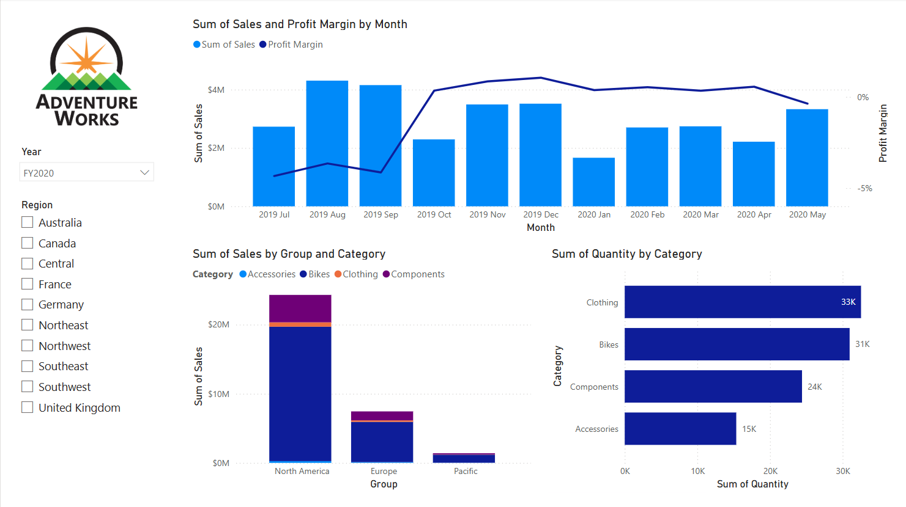
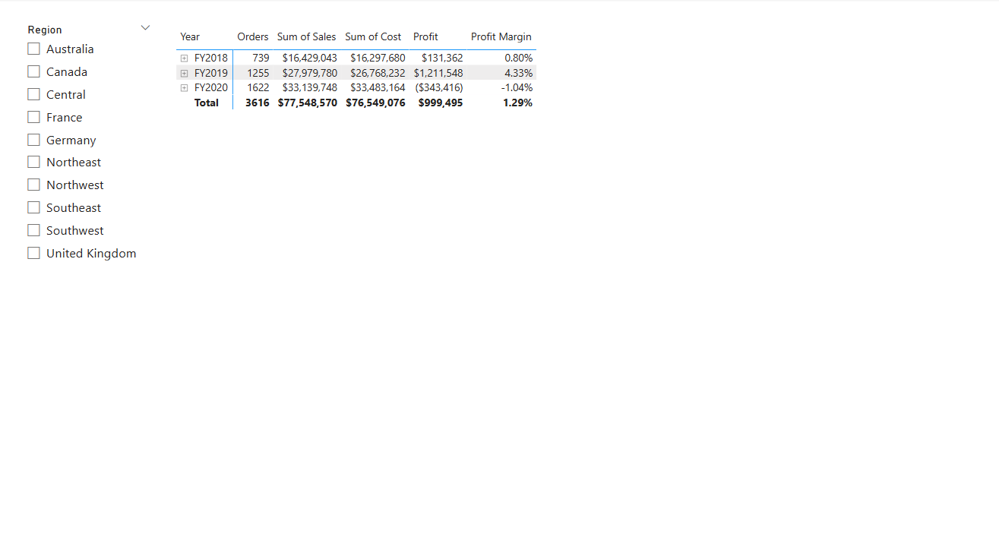
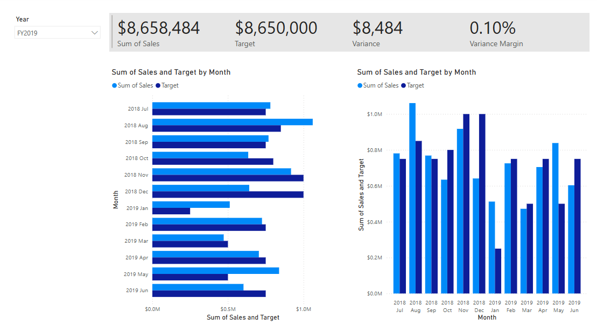

---
lab:
    title: 'Projektowanie raportów Power BI'
---

# Projektowanie raportów Power BI

## Opis laboratorium

W tym laboratorium utworzysz raport składający się z trzech stron, a następnie opublikujesz go w Power BI Service, gdzie otworzysz i przetestujesz raport.

W tym laboratorium nauczysz się:

- projektować raport,
- konfigurować pola wizualizacji i właściwości formatowania,
- synchronizować slicery,
- publikować raport do Power BI Service,
- pracować z wizualami raportu w usłudze.

**To laboratorium zajmie około 45 minut.**

---

## Rozpoczęcie

Pobierz plik ZIP:

`08-design-report.zip`

Rozpakuj do:

**C:\Users\Student\Downloads\08-design-report**

Otwórz:

**08-Starter-Sales Analysis.pbix**

> Możesz zobaczyć okno logowania – kliknij **Cancel**. Zamknij dodatkowe okna informacyjne. Jeśli pojawi się propozycja zastosowania zmian — **Apply Later**.

---

# Strona 1 — Overview

Po wykonaniu będzie wyglądała tak:

1. Zmień nazwę Page 1 → _Overview_  
2. Wstaw logo (Insert → Image → AdventureWorksLogo.jpg)
3. Ustaw logo w górnym lewym rogu
4. Dodaj slicer → `Date | Year` (ale pole, nie hierarchy!)
5. Format → Slicer settings → Dropdown
6. Ustaw poniżej logo
7. W slicerze wybierz **FY2020**

> Strona filtruje teraz dane po FY2020.

8. Dodaj drugi slicer → `Region | Region`
9. Ustaw pod pierwszym slicerem

---

### Dodaj wykres liniowo-kolumnowy

1. Visualizations → **Line and Stacked Column Chart**
2. Ustaw po prawej stronie
3. Pola:
   - `Date | Month`
   - `Sales | Sales`
4. Dodaj `Sales | Profit Margin` do Line y-axis

> Domyślnie brak czerwca, bo BLANK — pokaż miesiące bez danych:

5. W X-axis → Month → **Show items with no data**

---

### Dodaj stacked column chart

1. Visualizations → Stacked Column Chart
2. Pola:
   - X: `Region | Group`
   - Y: `Sales | Sales`
   - Legend: `Product | Category`

---

### Dodaj stacked bar chart

1. Visualizations → Stacked Bar Chart
2. Pola:
   - Y: `Product | Category`
   - X: `Sales | Quantity`
3. Format → Bars → Color
4. Włącz Data labels

> Koniec pierwszej strony — zapisz plik.

---

# Strona 2 — Profit

1. Dodaj nową stronę → _Profit_
2. Dodaj slicer `Region | Region`
3. Format → Select all
4. Dodaj Matrix
5. Rows → `Date | Fiscal`
6. Values:
   - `Orders`
   - `Sales`
   - `Cost`
   - `Profit`
   - `Profit Margin`

7. Filters:
   - Product | Category
   - Product | Subcategory
   - Product | Product
   - Product | Color

Zapisz plik.

---

# Strona 3 — My Performance

1. Nowa strona → _My Performance_
2. W Filters → Page level:
   - `Salesperson (Performance) | Salesperson`
3. Ustaw filtr → Michael Blythe

> Teraz raport pokazuje dane tylko tego sprzedawcy.

4. Dodaj slicer → `Date | Year` → FY2019
5. Dodaj Multi-row Card
6. Dodaj pola:
   - Sales
   - Target
   - Variance
   - Variance Margin
7. Format:
   - Callout → 28pt
   - Background → White 10% darker

8. Dodaj Clustered Bar Chart
   - Y: Date | Month
   - X: Sales, Target
9. Skopiuj wizual i zmień typ na Clustered Column Chart

Zapisz plik.

---

# Synchronizacja slicerów

1. Na Overview ustaw Year = FY2018
2. Zauważ — na My Performance inna wartość
3. View → Sync Slicers
4. Zaznacz page Overview i My Performance
5. Analogicznie dla Region → Overview i Profit
6. Przetestuj zmianę
7. Zamknij panel Sync Slicers

---

# Publikacja w Power BI Service

> Wymaga konta Power BI Free

1. Save
2. Home → Publish
3. Workspace → My Workspace
4. Otwórz https://app.powerbi.com
5. My Workspace
6. Otwórz raport
7. Testuj:
   - filtrowanie Region
   - cross filtering
   - focus mode wizuali
   - tooltips
   - Filters pane
   - Hierarchie
   - Full screen

---

# Koniec laboratorium

Zamknij PBI Desktop i przeglądarkę.