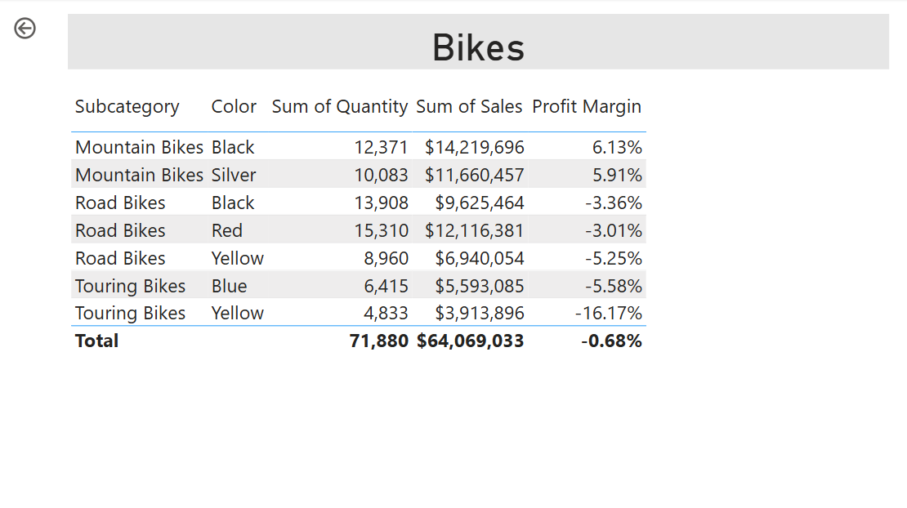
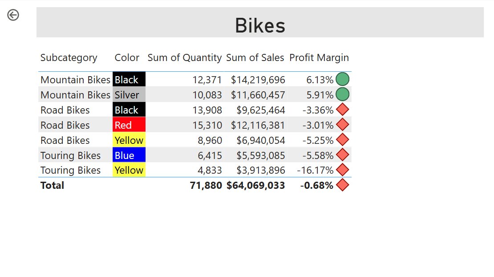
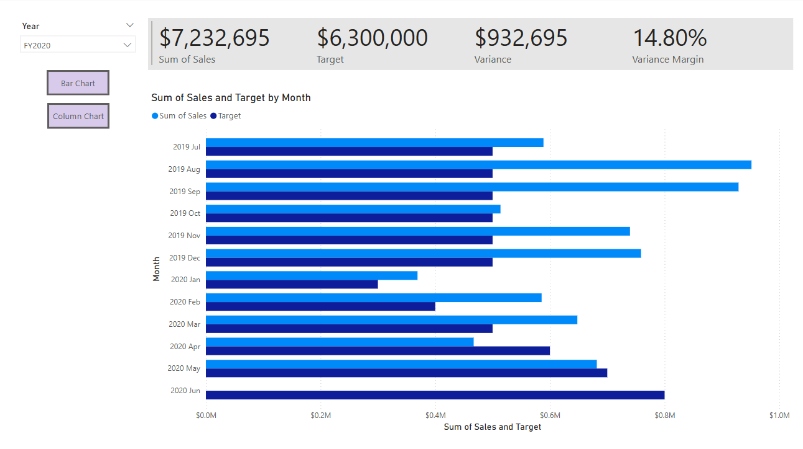

---
lab:
    title: 'Udoskonalanie projektów raportów Power BI'
---

# Udoskonalanie raportów Power BI

## Opis laboratorium

W tym laboratorium udoskonalisz raport **Sales Analysis** za pomocą bardziej zaawansowanych funkcji projektowych.

Nauczysz się:

- tworzyć stronę drillthrough,
- stosować formatowanie warunkowe,
- tworzyć i używać zakładek (bookmarks) oraz przycisków (buttons).

**Szacowany czas: 45 minut.**

---

## Rozpoczęcie

Pobierz ZIP:

`09-enhanced-report.zip`

Rozpakuj do:

**C:\Users\Student\Downloads\09-enhanced-report**

Otwórz:

**09-Starter-Sales Analysis.pbix**

> Możesz zobaczyć logowanie – wybierz **Cancel**. Jeśli okna o zmianach – wybierz **Apply Later**.

---

# Konfiguracja strony drillthrough

Po wykonaniu będzie wyglądać tak:

1. Utwórz stronę `_Product Details_`
2. PPM → Hide Page  
   > użytkownik końcowy nie przejdzie tam bez drillthrough
3. Pod wizualizacjami znajdź sekcję **Drill-through**
4. Przeciągnij `Product | Category`
5. Przetestuj – wybierz Bikes
6. Pojawi się automatycznie przycisk powrotu
7. Dodaj **Card**
8. Dodaj `Product | Category`
9. Format → Category Label = Off
10. General → Effects → Background (jasny szary)
11. Dodaj **Table**
12. Dodaj pola:
    - Product | Subcategory
    - Product | Color
    - Sales | Quantity
    - Sales | Sales
    - Sales | Profit Margin
13. Grid → Global font size = 20pt

---

# Formatowanie warunkowe

Wynik:

1. W tabeli → na `Profit Margin` → Conditional formatting → Icons
2. Icon layout → Right of Data
3. Usuń środkową regułę
4. Skonfiguruj:
   - czerwona ikonka → gdy < 0
   - zielona ikonka → gdy >= 0
   - number/number
5. Apply to → Values and totals
6. OK
7. Zweryfikuj ikony

---

## Formatowanie tła

1. Background color → Format Style: Field value
2. Field: `Product | Formatting | Background Color Format`

## Formatowanie koloru czcionki

1. Font Color → Field value
2. Field: `Product | Formatting | Font Color Format`

> Kolory pochodzą z pliku ColorFormats.csv dodanego w labach ETL w Power BI Desktop.

---

# Bookmarks i Buttons

Po wykonaniu:  

Cel: użytkownik może jednym kliknięciem przełączać typ wykresu.

1. Strona → _My Performance_
2. View → Bookmarks
3. View → Selection

4. W Selection ukryj jedną z wizualizacji `Sales and Target by Month`
5. Bookmarks → Add  
   nazwij np. *Bar Chart ON*
6. Edit bookmark → Data = OFF  
   > dzięki temu zakładka nie zapamiętuje filtrów

7. Update bookmark

8. Teraz odwróć widoczność
9. Dodaj drugi bookmark (Column Chart ON)
10. Data = OFF
11. Update bookmark

12. Ustaw oba wizuale jeden na drugim (Selection Pane pomaga)

13. Testuj bookmarki

---

## Dodaj przyciski

1. Insert → Button → Blank
2. Pod Year slicer
3. Format → Style → Text = On
4. Text: Bar Chart
5. Fill: kolor
6. Action: On → Type: Bookmark
7. Bookmark: Bar Chart ON

8. Kopia (Ctrl+C / Ctrl+V)
9. Tekst: Column Chart
10. Bookmark: Column Chart ON

---

# Publikacja

> wymaga Power BI Free

1. Na Overview wybierz:
   - Year = FY2020
   - Region = All
2. Save
3. Home → Publish
4. Workspace → My Workspace
5. W PowerBI.com → otwórz raport
6. Przetestuj:
   - Drill Through (PPM → Drill Through → Product Details)
   - Buttons
   - Bookmarks

---

# Koniec laboratorium

1. Zamknij przeglądarkę  
2. Zamknij Power BI Desktop